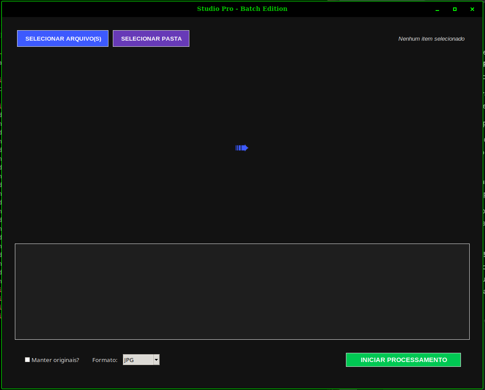
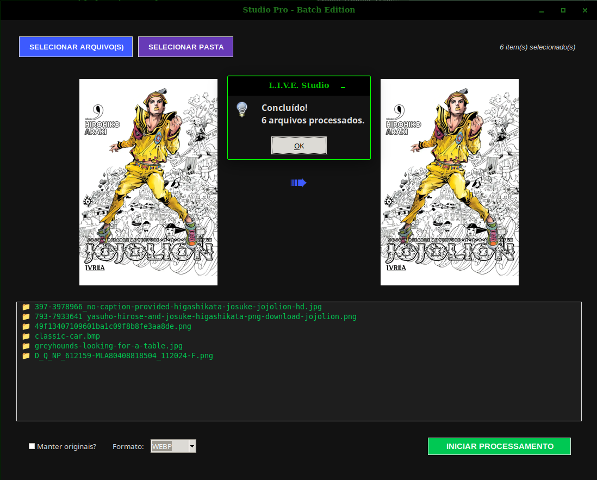
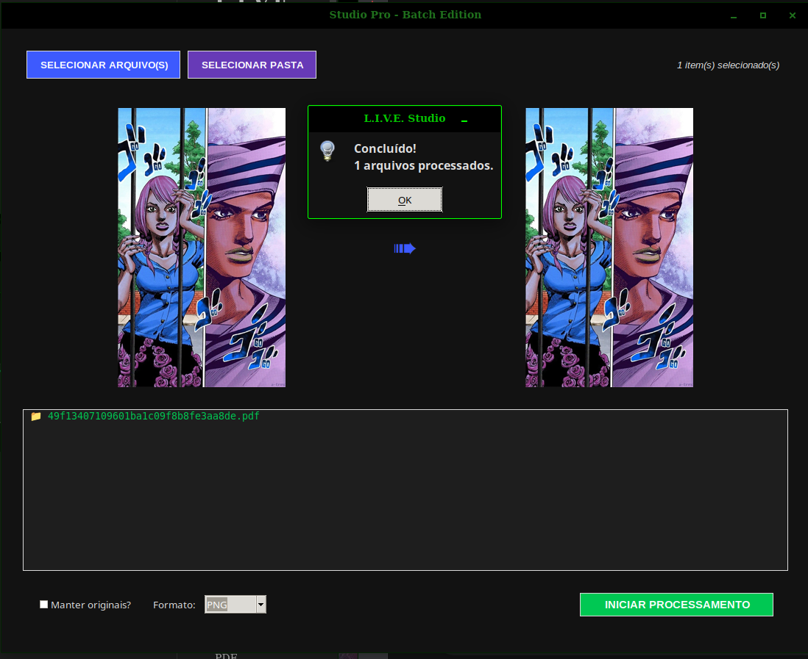
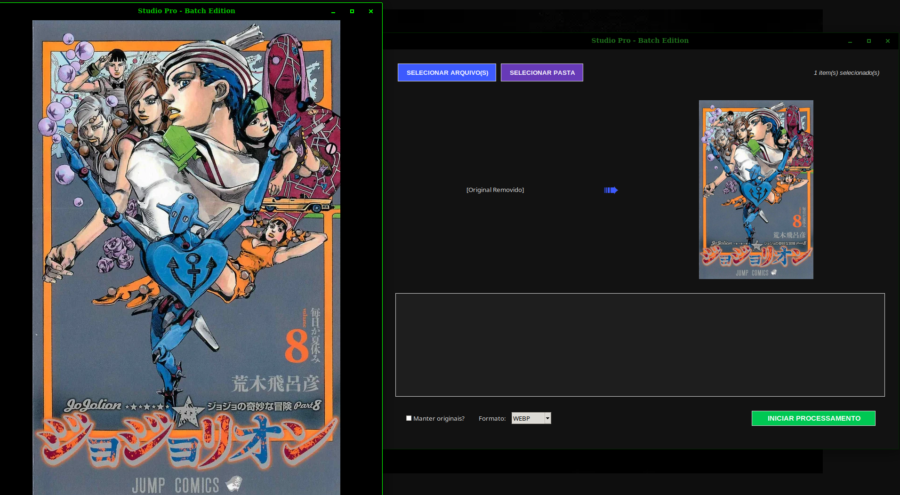
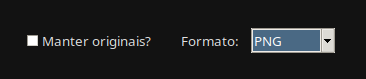

# L.I.V.E. Studio Pro: Batch Edition
O L.I.V.E. Studio Pro é um motor de processamento de imagem em lote desenvolvido para otimizar fluxos de trabalho criativos e acadêmicos. Ele combina a simplicidade de uma interface gráfica com o poder de bibliotecas de processamento profissional, permitindo transições rápidas entre formatos de imagem, vetores e documentos PDF.

## Diferenciais
**Arquitetura Híbrica** para rodar em máquinas de processamento pesado e notebooks; **Motor PDF** é integrado para renderizar páginas de documentos como imagens de alta definição; **Suporte RAW** tem a capacidade de ler e processar arquivos *.raw* e *.dng* extraído de câmeras fotográficas; Além do **Feedback visual imediato**, um sistema de preview duplo que permite conferir o resultado da conversão no proprio motor.

## Funcionalidades

### Processamento Massivo de Pastas

O sistema permite carregar diretórios inteiros, filtrando automaticamente extensões compatíveis e preparando-as para uma conversão em cadeia.

### Conversão de PDF para Imagem

Ideal para extrair artes ou converter documentos para formatos web (WEBP/JPG). O sistema identifica o PDF e gera uma imagem fiel da primeira página.

### Sistema de Zoom Dinâmico
Ao clicar em qualquer imagem (original ou resultado), o sistema abre uma visualização em tela cheia (tecla Esc para sair), facilitando a inspeção de qualidade sem sair da ferramenta.

#### "Manter Originais?"
Opção para um controle eficien do armazenamento. Quando **ativado**, o sistema preserva os arquivos originais e cria as novas versões no mesmo diretório. Ao ser **desativado**, haverá uma conversão limpa, removendo automaticamente o arquivo de origem após o sucesso da geração do novo formato.

## Tecnologias e Dependências
O projeto é construído sobre um stack robusto em Python:

* Pillow (PIL): Manipulação principal e salvamento de imagens.

* PyMuPDF (fitz): Renderização de alta performance para arquivos PDF.

* Rawpy: Processamento de dados brutos de imagem (RAW).

* Tkinter: Interface gráfica leve e multiplataforma.

* Svilig/ReportLab: Suporte para conversão de vetores SVG.

## Instalação e Uso
### Instale as dependências via requirements.txt:

``pip install -r requirements.txt``

### Execute a aplicação

``python conversao.py``

# Desenvolvido: Luca Atanazio 
## Estudante de Inteligência Artificial
# 21/04/2026